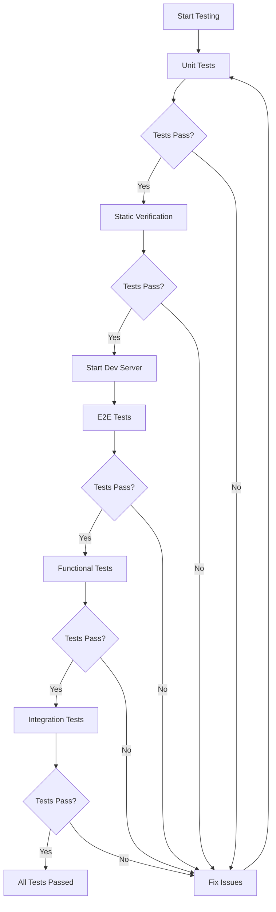

# Educy Platform - Comprehensive Testing Guide

## Overview

This document provides a complete guide to testing the Educy platform, including unit tests, integration tests, and end-to-end (E2E) tests.

## Test Structure

```
educy/
├── __tests__/              # Unit and integration tests (Jest)
│   ├── lib/               # Library utility tests
│   ├── components/        # Component tests
│   └── api/               # API route tests
├── e2e/                   # End-to-end tests (Playwright)
│   ├── auth.spec.ts      # Authentication flow tests
│   └── rbac.spec.ts      # RBAC and access control tests
└── tests/                 # Bash-based functional tests
    ├── static-verification.sh
    ├── comprehensive-functional-tests.sh
    ├── live-integration-test.sh
    └── run-all-tests.sh
```

## Test Categories

### 1. Unit Tests (Jest)

Unit tests focus on testing individual functions and utilities in isolation.

**Location**: `__tests__/`

**Coverage**:
- ✅ RBAC (Role-Based Access Control) - 15 tests
- ✅ Password generation - 11 tests
- ✅ Audit logging - 20 tests

**Run commands**:
```bash
# Run all unit tests
npm test

# Run tests in watch mode
npm run test:watch

# Run tests with coverage
npm run test:coverage

# Run specific test file
npm test rbac.test.ts
```

**Example test structure**:
```typescript
describe('RBAC (Role-Based Access Control)', () => {
  test('should have permissions defined for all roles', () => {
    expect(ROLE_PERMISSIONS[RoleName.ADMIN]).toBeDefined()
  })
})
```

### 2. End-to-End Tests (Playwright)

E2E tests simulate real user interactions with the application.

**Location**: `e2e/`

**Coverage**:
- ✅ Authentication flow (7 tests)
- ✅ Landing page (3 tests)
- ✅ RBAC and protected routes (12 tests)
- ✅ Public pages accessibility (2 tests)

**Run commands**:
```bash
# Run E2E tests (starts dev server automatically)
npm run test:e2e

# Run E2E tests with UI
npx playwright test --ui

# Run specific test file
npx playwright test e2e/auth.spec.ts

# View test report
npx playwright show-report
```

**Prerequisites**:
- Application must be running on http://localhost:3000
- Or use `npm run test:e2e` which starts the server automatically

### 3. Static Verification Tests (Bash)

These tests verify code structure, patterns, and configurations without running the app.

**Location**: `tests/static-verification.sh`

**Coverage**: 67 tests including:
- Build verification
- File structure validation
- Security pattern verification
- Configuration checks
- Database schema validation

**Run commands**:
```bash
# Run static tests
npm run test:static

# Or directly
./tests/static-verification.sh
```

### 4. Functional Tests (Bash)

Comprehensive functional tests that interact with the running application.

**Location**: `tests/comprehensive-functional-tests.sh`

**Coverage**: 30+ tests including:
- Authentication & authorization
- Admin user management
- Input validation
- Role-based access control
- Course management
- Database consistency
- Security verification
- Race condition prevention

**Run commands**:
```bash
# Start dev server in one terminal
npm run dev

# Run functional tests in another terminal
npm run test:functional

# Or with admin password
export ADMIN_PASSWORD="admin123"
./tests/comprehensive-functional-tests.sh
```

### 5. Integration Tests (Bash)

Tests that verify external service integrations.

**Location**: `tests/live-integration-test.sh`

**Coverage**: 27 tests including:
- Database connectivity
- Cloudflare R2 file storage
- Google Gemini AI API
- Resend email service
- API endpoint availability

**Run commands**:
```bash
# Requires running server
npm run dev

# Run integration tests
./tests/live-integration-test.sh
```

## Complete Test Suite

### Run All Tests

```bash
# Run everything (requires running server)
npm run test:all

# Or
./tests/run-all-tests.sh
```

This will execute:
1. Static verification tests (~5 seconds)
2. Comprehensive functional tests (~60 seconds)

### Test Workflow



## Test Results Summary

### Current Test Coverage

| Test Category | Tests | Passing | Status |
|--------------|-------|---------|--------|
| Unit Tests (Jest) | 46 | 46 | ✅ 100% |
| E2E Tests (Playwright) | 24 | TBD | ⚠️ Requires running app |
| Static Verification | 67 | 67 | ✅ 100% |
| Functional Tests | 30+ | TBD | ⚠️ Requires running app |
| Integration Tests | 27 | TBD | ⚠️ Requires running app |

### Total Coverage

- **Total Tests**: 194+
- **Unit Test Coverage**: RBAC, Password, Audit utilities
- **E2E Coverage**: Authentication, RBAC, Public pages
- **Functional Coverage**: All major features

## Writing New Tests

### Unit Test Example

```typescript
// __tests__/lib/myutil.test.ts
import { myFunction } from '@/lib/myutil'

describe('MyUtil', () => {
  test('should do something', () => {
    const result = myFunction('input')
    expect(result).toBe('expected')
  })
})
```

### E2E Test Example

```typescript
// e2e/myfeature.spec.ts
import { test, expect } from '@playwright/test'

test('should perform user action', async ({ page }) => {
  await page.goto('/my-page')
  await page.click('button')
  await expect(page.locator('.result')).toBeVisible()
})
```

## CI/CD Integration

### GitHub Actions Example

```yaml
name: Tests
on: [push, pull_request]
jobs:
  test:
    runs-on: ubuntu-latest
    steps:
      - uses: actions/checkout@v3
      - uses: actions/setup-node@v3
        with:
          node-version: '18'
      - run: npm install
      - run: npm test
      - run: npm run test:static
      - run: npm run build
```

## Troubleshooting

### Common Issues

**Issue**: Jest tests fail with module errors
**Solution**: Ensure `jest.config.js` and `jest.setup.js` are properly configured

**Issue**: Playwright tests timeout
**Solution**: Ensure dev server is running on port 3000

**Issue**: Functional tests fail
**Solution**: Set `ADMIN_PASSWORD` environment variable

**Issue**: Integration tests fail
**Solution**: Verify all environment variables are set correctly

### Debug Commands

```bash
# Run Jest in debug mode
node --inspect-brk node_modules/.bin/jest --runInBand

# Run Playwright in debug mode
PWDEBUG=1 npx playwright test

# Run specific test with verbose output
npm test -- --verbose mytest.test.ts
```

## Best Practices

1. **Write tests before fixing bugs** - Helps prevent regressions
2. **Keep tests independent** - Each test should work in isolation
3. **Use descriptive test names** - Makes failures easier to understand
4. **Test edge cases** - Don't just test happy paths
5. **Mock external dependencies** - Keep tests fast and reliable
6. **Maintain test data** - Use factories or fixtures for test data
7. **Run tests before commits** - Catch issues early

## Test Maintenance

### Regular Tasks

- [ ] Run full test suite weekly
- [ ] Update tests when features change
- [ ] Add tests for new features
- [ ] Review and update test documentation
- [ ] Monitor test execution time
- [ ] Keep dependencies updated

### Coverage Goals

- Unit Tests: >80% coverage
- E2E Tests: Cover critical user flows
- Integration Tests: All external services
- Functional Tests: All API endpoints

## Resources

- [Jest Documentation](https://jestjs.io/)
- [Playwright Documentation](https://playwright.dev/)
- [Testing Library](https://testing-library.com/)
- [Next.js Testing](https://nextjs.org/docs/testing)

## Contributing

When adding new features:
1. Write unit tests first
2. Add E2E tests for user flows
3. Update functional tests if needed
4. Run full test suite before PR
5. Update this documentation

---

Last Updated: January 13, 2026
Version: 1.0.0
